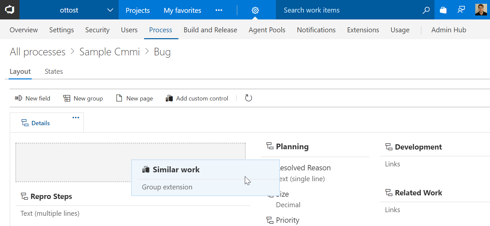
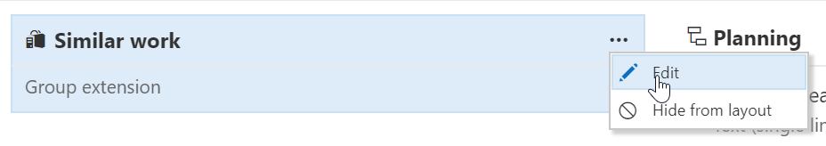
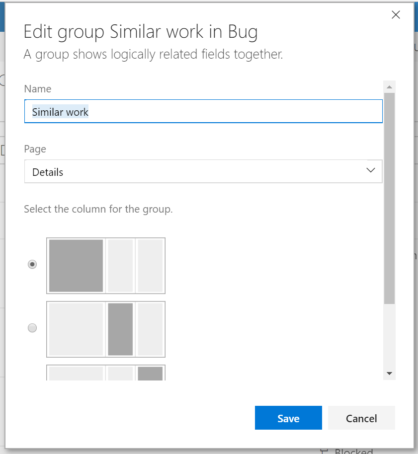

# Getting Started
## VSTS
Navigate to the process admin page. Hide or move the group to the desired location of the form.  
  
To rename the group select edit from the context menu
  
Then enter the new name and save  
  
## On Premise
Navigate the process template xml.
For each work item type to customize at the location 
```xpath
/WITD/WORKITEMTYPE/FORM/WebLayout/Extensions
```
add 
```xml
<Extension Id="ottostreifel.duplicates-bug" />
```
Within the same Weblayout choose a Section element and add
```xml
<GroupContribution Label="Similar Work" Id="ottostreifel.duplicate-bug.duplicates-group"/>
``` 
