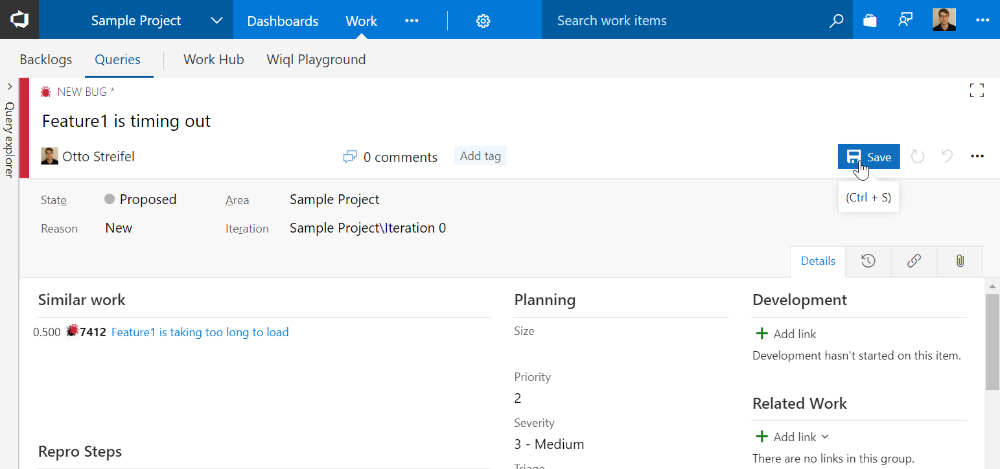
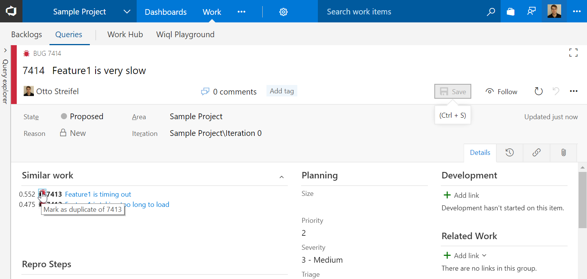
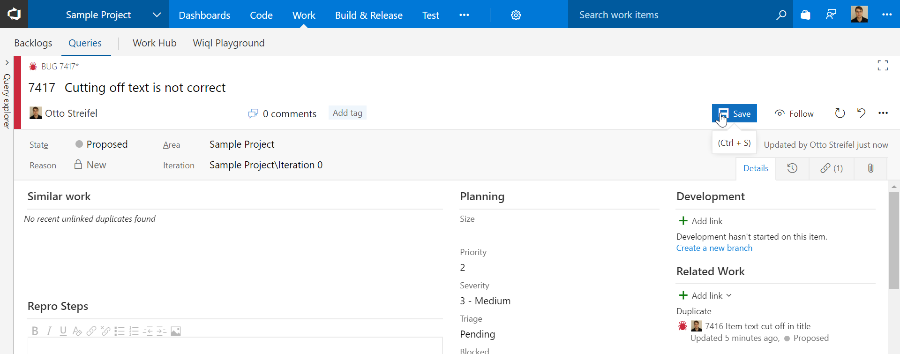

As soon as fields are filed out on a new workitem suggested duplicates will be shown. These suggestions will also be shown for existing work items.  
  
Select the work item that the current one duplicates  
  
Update any other fields and save the work item. 
   

# Change Log
(07/25/2017) 1.0.6 Link repo  
Restrict to compatible versions of on premise  
(07/24/2017) 1.0.1 Initial Release  
