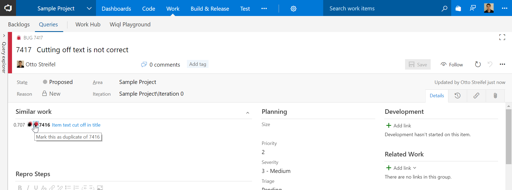

As soon as fields are filed out on a new workitem suggested duplicates will be shown. These suggestions will also be shown for existing work items.  
  
Mark the suggested work items as duplicates  
  
Save the duplicate link  
  

# Change Log
(07/24/2017) 1.0.0 Initial Release  
