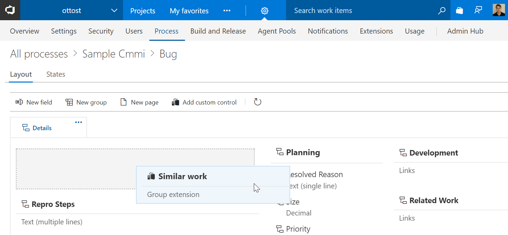
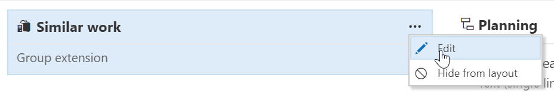
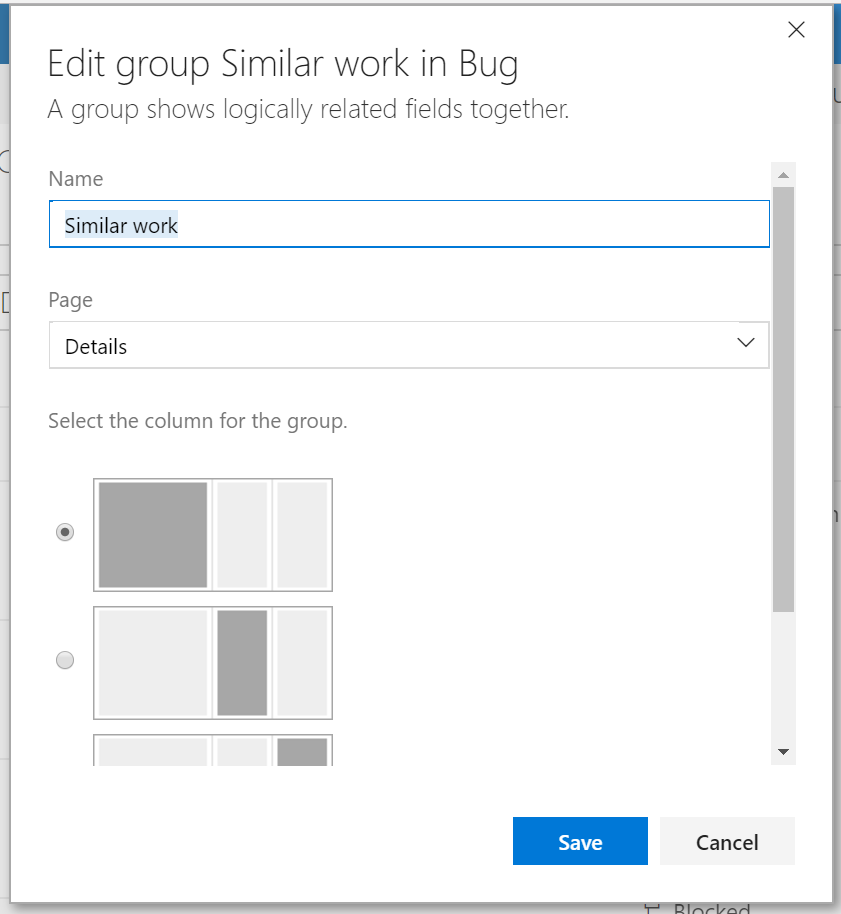

As soon as fields are filed out on a new workitem suggested duplicates will be shown. These suggestions will also be shown for existing work items.  
  
Select the work item that the current one duplicates  
  
Update any other fields and save the work item. 
  

# Getting Started
## VSTS
Navigate to the process admin page. Hide or move the group to the desired location of the form.  
  
To rename the group select edit from the context menu
  
Then enter the new name and save  
  
## On Premise
Navigate the process template xml.
For each work item type to customize at the location 
```xpath
/WITD/WORKITEMTYPE/FORM/WebLayout/Extensions
```
add 
```xml
<Extension Id="ottostreifel.duplicates-bug" />
```
Within the same Weblayout choose a Section element and add
```xml
<GroupContribution Label="Similar Work" Id="ottostreifel.duplicate-bug.duplicates-group"/>
``` 

# Change Log
(07/25/2017) 1.0.6 Link repo  
Restrict to compatible versions of on premise  
(07/24/2017) 1.0.1 Initial Release  
